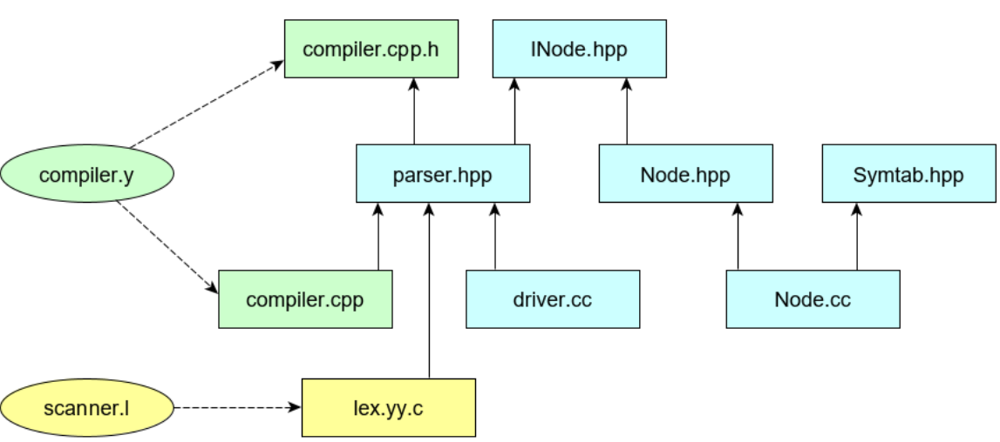

# ParaCL #

### Author: Goncharov Mark

There's the simplest programming language ParaCL. 
You can check examples at folder "Tests". In project was used ```Bison + Flex``` and soon will be
```LLVM``` backend. It's creating at folder "../LLVM"

Projecting scheme:
